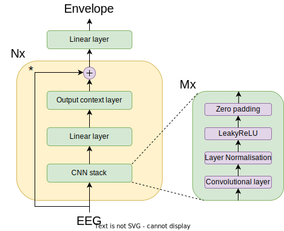

Accurate decoding of the speech envelope using the VLAAI deep neural network.
=============================================================================

[](https://www.python.org/downloads/)
[](https://tensorflow.org)
[](./LICENSE)
[](https://black.readthedocs.io/en/stable/)
[](https://flake8.pycqa.org/en/latest/)
[](https://colab.research.google.com/github/berndie/vlaai/blob/main/examples/evaluation_on_the_DTU_dataset.ipynb).




This repository contains a pre-trained subject-independent model that can
decode the speech envelope from EEG signals. The model was presented in the 
paper:

[Accurate decoding of the speech envelope using the VLAAI deep neural network](./#)

by [Bernd Accou](https://gbiomed.kuleuven.be/english/research/50000666/50000672/people/members/00114712), [Jonas Vanthornhout](https://gbiomed.kuleuven.be/english/research/50000666/50000672/people/members/00077061), [Hugo Van hamme](https://www.kuleuven.be/wieiswie/en/person/00040707), and [Tom Francart](https://gbiomed.kuleuven.be/english/research/50000666/50000672/people/members/00046624).

# Using the VLAAI network

Code for building the VLAAI network is available in the [model.py](./model.py)
file. This code is written in [TensorFlow](https://www.tensorflow.org/), using
version v2.3.0 and Python 3.6. You can use it as follows:

```python
# Import the model
from model import vlaai
# Instantiate the model
decoder = vlaai()

## If you want to compile the model (for training), you can do so as follow
# s:
# Import the loss and metric function
from model import pearson_loss, pearson_metric
# Compile the model
decoder.compile(optimizer='adam', loss=pearson_loss, metrics=[pearson_metric])
```

Pre-trained model versions (using the preprocessing and dataset (
single-speaker stories dataset, 80 subjects that listened to 1 hour and 46 
minutes on average for a total of 144 hours of EEG data) in the 
[paper](./#)) are available in the [pretrained_models](./pretrained_models)
(see also [this document](./pretrained_models/README.md) for more 
information).

Three formats are provided:

1. TensorFlow SavedModel format ([pretrained_model/vlaai](./pretrained_models/vlaai))
2. HDF5 format ([pretrained_model/vlaai.h5](./pretrained_models/vlaai.h5))
3. ONNX format ([pretrained_model/vlaai.onnx](./pretrained_models/vlaai.onnx))

You can choose to load the full model, including optimizer state, as follows:

```python
import tensorflow as tf
# Import the loss and metric function
from model import pearson_loss, pearson_metric

# Load the model from TensorFlow SavedModel format
decoder = tf.keras.models.load_model(
    'pretrained_models/vlaai', 
    custom_objects={
        'pearson_loss': pearson_loss, 
        'pearson_metric': pearson_metric
    }
)

# Or, load the model from HDF5 format
decoder = tf.keras.models.load_model(
    'pretrained_models/vlaai.h5', 
    custom_objects={
        'pearson_loss': pearson_loss, 
        'pearson_metric': pearson_metric
    }
)
```

It is also possible to just load the weights from the HDF file:

```python
# Import the model
from model import vlaai
decoder = vlaai()
# Load the weights
decoder.load_weights('pretrained_models/vlaai.h5')
```


# Running the examples

The [examples](./examples) directory contains code for evaluating the VLAAI 
network in Jupyter notebook format. These notebooks can be run on Google Colab
using their [github integration](https://colab.research.google.com/github/googlecolab/colabtools/blob/master/notebooks/colab-github-demo.ipynb)

The example notebook where the pre-trained VLAAI network is evaluated on the 
[DTU dataset by Fuglsang et al.](https://zenodo.org/record/1199011)
can be executed on Google Colab using the following link:

[](https://colab.research.google.com/github/berndie/vlaai/blob/main/examples/evaluation_on_the_DTU_dataset.ipynb).


